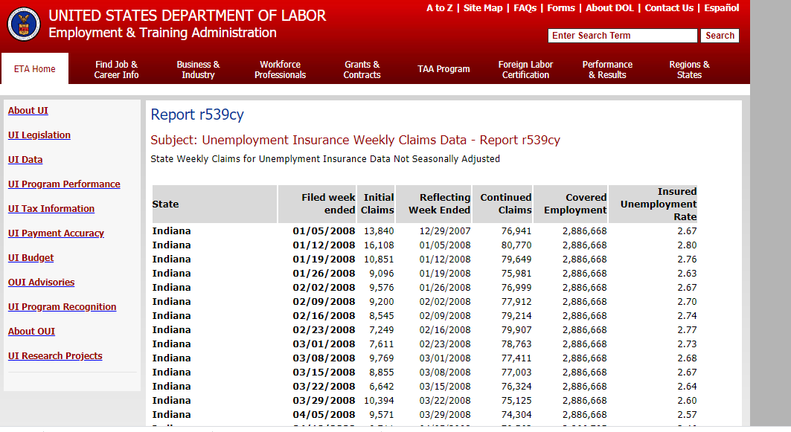
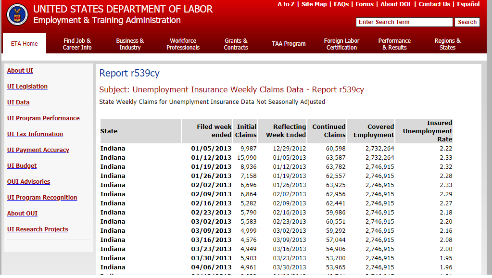
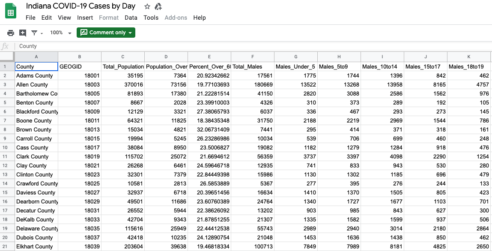

# 
 **Look at Unemployment numbers from 2008-current and the number of Coronovirus cases - by Indiana County**

- Is there a relationship between increases in unemployment and the number of reported Coronovirus cases, by county
- Are there any differences between rural and urban counties
- Display a timeseries plot showing unemployment rate decreases/increases along with increases in Coronvirus cases

## 
 **Data sources** 

- United States Bureau of Labor Statistics (BLS) (https://data.bls.gov/PDQWeb/la)
- SAVI Indiana Coronavirus Data Hub (https://polis.iupui.edu/savi-indiana-coronavirus-data-hub/)
- Kaggle - U.S. Unemployment Rate by County, 1990-2016 (https://www.kaggle.com/jayrav13/unemployment-by-county-us)

#### Indiana Unemployment 1

#### Indiana Unemployment 2

#### Covid Cases

## 
 **Screenshots of viz ideas**  

#### Unemployment Viz

#### Index Page

## Final design scetch
- Home page - Indiana choropleth
- 4(ish) county pages

- County Breakdown
    * Sumi: Warrick, Boone, Lake
    * Emmaneual:  Hamilton, Allen, Hendricks
    * Nirmal:  Johnson, Decatur, Vanderburgh
    * Michael:  Marion, Monroe, St. Joseph

- Timeline
    * By Tuesday - read data (CSV or API), ETL, create county plots (all in Python)
    * Tuesday class - cover plots, begin building web pages (Leaflet/Plotly, Flask, MongoDb, HTML/CSS, JavaScript)
        - select a new JavaScript library
    * Wednesday - Thursday - finish building web pages, build statewide landing page
    * Thursday class - complete pages, test, begin presentation prep
    * Friday - practice for 10 minute presentation 

## GitHub
- https://github.com/sumic59/Project-2

## Tools Used
- D3.js
- Leaflet or Plotly
- Python Flask
- MongoDb or SQL or SQLite    ---UPDATE
- HTML/CSS
- JavaScript
- GitHub
- Java Script library ???

## Authors
- Sumi Justin
- Nirmal Jacob
- Michael Davis
- Emmanuel Olofinkua

